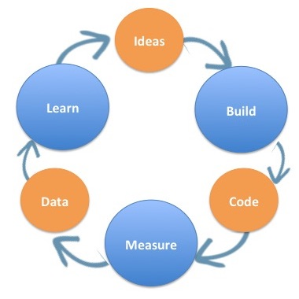

Sendo nós desenvolvedores, sempre tentamos nos aperfeiçoar em termos tecnológicos: testar um novo framework, uma nova linguagem ou uma tecnologia nova que nos chama a atenção. Mas até que ponto isso interfere na entrega final  para os usuários?

<!--truncate-->

Ao se tratar do desenvolvimento de um produto, temos alguns recursos que são finitos: como o tempo e o dinheiro (há quem diz que são a mesma coisa). Um produto atrasado representa maior custo e abre a possibilidade de algum concorrente sair na frente. Por isso, precisamos trabalhar com os dois lados da mesma moeda. Ser conservador em termos tecnológicos ou partir sempre para a inovação sem limites. Como encontrar um balanço justo?

A finalidade desse post é ser prático apresentando de forma resumida e em poucas palavras, esses recursos e dissertando um pouco a função de cada uma:

## Ser conservador no começo é essencial.
Queremos sempre inovar, isso é um fato. Mas se tratando de um produto novo, temos um mar de incertezas a ser desbravado e o que mais queremos é **resolver a dor de nossos usuários e saber se esse produto vai ter uma boa aderência no mercado.**

Para isso, temos processos de validações e experimentações, que envolve criar um pequeno pedaço do produto e testá-lo com um grupo de possíveis usuários, com a finalidade de entender se as hipóteses que temos são válidas ou não. Daí a necessidade de entregas ágeis em ciclos curtos. Ter uma hipótese (ideia) → gerar o experimento (codar) → validar (mensurar e analisar os dados) → aprender com os resultados.

Quanto mais rápido e assertivo este ciclo, mais maduro e afiado para resolver a dor do usuário seu produto ficará. Seguindo então a velha máxima: errar rápido para corrigir rápido.

Você já deve ter percebido que nesta etapa de validações iniciais, onde você quer provar as suas hipóteses, é crucial a velocidade: quanto mais domínio das tecnologias envolvidas, mais rápido vai ser as entregas. Por isso, utilize o que o seu time já tem o know-how. Dessa forma, mais rápido você conseguirá implementar aquele “pedacinho” e entender se faz sentido para os futuros clientes. Lembre-se: a **maior descoberta a ser feita nesse momento é a validação da hipótese em si**. 

É claro que irá existir validações durante toda a vida do produto. Mas enquanto seu projeto não entra na fase de escalada, ou seja, ainda não ganhou tração, não caminha com "as próprias pernas", esse ciclo deve ser seguido com a finalidade de provar o valor que o produto entrega. 

Conforme o ciclo roda, são possibilidades da evolução técnica também! A ideia não é anular a tecnologia, mas focar no que mais interessa: resolver **o problema do usuário**.

## Ser simples, sem ser simplório.
Por outro lado, devemos tomar todo o cuidado do mundo para não gerar retrabalho. **Um código simples não é o mesmo que não testado ou mal escrito.**

Há uma diferença fundamental entre ser simples e ser simplório. **Os simples resolvem a complexidade, os simplórios a evitam.**

### Padrões para manter a consistência.
Existem meios de manter o time focado na entrega do produto e ao mesmo tempo garantir que está sendo entregue código de qualidade. Algumas dicas podem ser úteis nesse processo:

- Para iniciar a arquitetura, um bom ponto de partida é usar um gerador de projetos por possibilitar criar algo instantaneamente e com um padrão pré-estabelecido. No front, diria algo como o create-react-app do React ou o vue CLI do vuejs.
- Boas práticas devem ser seguidas desde o começo. Adotando uma arquitetura e um estilo de código difundido, ajuda o trabalho em equipe ficar mais simples, na comunicacao e na homogeneidade e leitura do código.
- Sugiro fortemente a adoção de uma ferramenta de teste estático como o Eslint para javascript e um preset de regras como o do Airbnb. A execucao dessa ferramenta pode ser facilmente integrado ao pré-commit usando o Husky por exemplo, ou diretamente através do Github Actions, CI do próprio Github, evitando que códigos sejam mesclados na sua branch principal fora do padrão pré estabelecido.

### Automatizar processos repetitivos e ganhar tempo.
É importante que desde o começo, seu projeto seja capaz de realizar trabalhos repetitivos de forma automática, liberando o tempo para se preocupar com o que realmente interessa e não com algo que possa ser facilmente automatizado. 

Hoje em dia, existem muitas ferramentas de automatização para realizar integração contínua e deploy contínuo (`CI/CD`). Alguns deles diretamente na plataforma de repositórios que você pode estar utilizando hoje mesmo. Através dessas plataformas, você consegue disparar ações a partir de eventos. Exemplos como: ao criar um Pull Request, execute os testes e análise estática (`lint`), ou mesmo ao fazer o merge de um PR na branch principal, execute os procedimentos de build e já publique a aplicação. 

As documentações costumam ser bem ricas e com pouco conhecimento de `.yaml` é possível criar processos que ao longo do percurso de desenvolvimento, poupará muito tempo do seu time. Algumas dessas ferramentas, seriam:

- Github Actions
- Gitlab CI
- Bitbucket Pipelines

## Quebre um grande problema em partes menores.
Este fator pode ser mais teórico, mas não menos importante que os outros. 

Muitas vezes será preciso inovar e fazer algo que seja difícil de encontrar um case tão pronto e maduro. Talvez pode ser preciso criar um experimento, às vezes vários experimentos. Assim como o processo de validação de uma hipótese, também é preciso aprender rápido com isso! 

Desenvolver experimentos grandes, podem lhe fazer gastar um tempo desnecessário, caso descubra tardiamente que caminhou na direção errada. **Crie pequenas provas de conceitos que se provem, que consigam validar uma parte menor.** Continue validando e conectando os pontos. Seguir dessa maneira pode te ajudar a encontrar uma solução para um problema maior sem ficar preso em um conceito muito complexo de digerir de uma vez só.

Pode parecer conceitual demais, mas sempre aplico essa abordagem quando preciso fazer algo diferente do cotidiano. Desde escolher um novo Framework UI para algum projeto até mesmo para definir a arquitetura de um projeto mais complexo e grande.

## Conclusão
Com esse conteúdo, tentei passar conhecimentos que aprendi participando do desenvolvimento de  produtos digitais. Entregar inovação tecnológica e valor ao cliente ao mesmo tempo é sempre algo desafiador que irá nos trazer aprendizados inesgotáveis. **E ai? Tem alguma experiência ou aprendizado que fez toda a diferença para você?**
